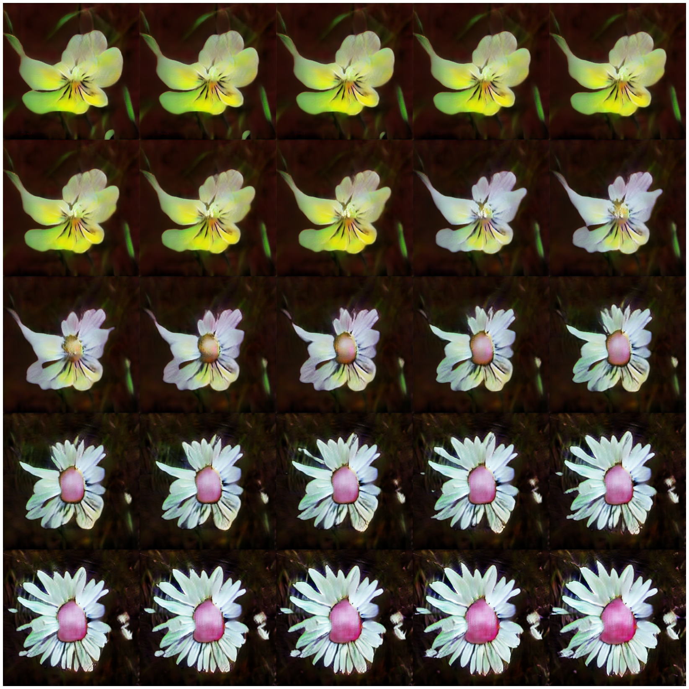

# Towards Faster and Stabilized GAN Training for High-fidelity Few-shot Image Synthesis

*Unofficial implementation*, with understandability in mind (verbose implementation)

> Why the name *SLE-GAN*? Because the paper introduces a new block in the Generator network called *Skip-Layer Excitation (SLE)*

- [Paper](https://openreview.net/forum?id=1Fqg133qRaI)

</a> </a>

> *512x512 generated images (randomly selected) trained for 9 hours with batch size of 8 on [Oxford 17 flowers dataset](https://www.robots.ox.ac.uk/~vgg/data/flowers/17/index.html)
which contains only 1360 images*

The implementation tries to replicate the results from the paper based only on the publication.

What is not discussed in the paper (e.g. filter sizes, training scheduling, hyper parameters), is chosen based on some
experiments and previous knowledge.

## Usage

You can easily use the separate parts of the code. The `Generator` and `Discriminator` are Tensorflow Keras models (`tf.keras.models.Model`)

For example if you'd like to generate new images:

```python
import sle_gan

G = sle_gan.Generator(output_resolution=512)
G.load_weights("generator_weights.h5")

input_noise = sle_gan.create_input_noise(batch_size=1)
generated_images = G(input_noise)
generated_images = sle_gan.postprocess_images(generated_images, tf.uint8).numpy()
```

## Train

```
$ python train.py --help

usage: train.py [-h] [--name NAME] [--override] --data-folder DATA_FOLDER
                [--resolution RESOLUTION]
                [--generator-weights GENERATOR_WEIGHTS]
                [--discriminator-weights DISCRIMINATOR_WEIGHTS]
                [--batch-size BATCH_SIZE] [--epochs EPOCHS]
                [--G-learning-rate G_LEARNING_RATE]
                [--D-learning-rate D_LEARNING_RATE] [--diff-augment] [--fid]
                [--fid-frequency FID_FREQUENCY]
                [--fid-number-of-images FID_NUMBER_OF_IMAGES]

optional arguments:
  -h, --help            show this help message and exit
  --name NAME           Name of the experiment
  --override            Removes previous experiment with same name
  --data-folder DATA_FOLDER
                        Folder with the images
  --resolution RESOLUTION
                        Either 256, 512 or 1024. Default is 512.
  --generator-weights GENERATOR_WEIGHTS
  --discriminator-weights DISCRIMINATOR_WEIGHTS
  --batch-size BATCH_SIZE
  --epochs EPOCHS
  --G-learning-rate G_LEARNING_RATE
                        Learning rate for the Generator
  --D-learning-rate D_LEARNING_RATE
                        Learning rate for the Discriminator
  --diff-augment        Apply diff augmentation
  --fid                 If this is used, FID will be evaluated
  --fid-frequency FID_FREQUENCY
                        FID will be evaluated at this frequency (epochs)
  --fid-number-of-images FID_NUMBER_OF_IMAGES
                        This many images will be used for the FID calculation
```

FID score calculation can be enabled with the `--fid` flag. Just pay attention that as the caluclation uses
the Inception model, you need some extra GPU memory.

Example train command:

```
$ python train.py --name experiment_1 --resolution 512 --batch-size 8 --diff-augment --fid --fid-number-of-images 256
```

## Differences from the paper

- Instead of random cropping to get `I_{part}` now only center cropping is implemented
- Optionally you can use [Differentiable Augmentations](https://arxiv.org/abs/2006.10738) (`--diff-augment`)

### Not mentioned in the paper

In these cases I took the freedom and defined these myself based on previous experience

- Number of filters in the Generator and Discriminator
- How they change the architecture for resolutions `256`, `1024` (or any other resolution)
- Training schedule, or any hyperparameter connected to the training

## Citations

```bibtex
@inproceedings{
    anonymous2021towards,
    title={Towards Faster and Stabilized {\{}GAN{\}} Training for High-fidelity Few-shot Image Synthesis},
    author={Anonymous},
    booktitle={Submitted to International Conference on Learning Representations},
    year={2021},
    url={https://openreview.net/forum?id=1Fqg133qRaI},
    note={under review}
}
```

```bibtex
@misc{
      zhao2020differentiable,
      title={Differentiable Augmentation for Data-Efficient GAN Training}, 
      author={Shengyu Zhao and Zhijian Liu and Ji Lin and Jun-Yan Zhu and Song Han},
      year={2020},
      eprint={2006.10738},
      archivePrefix={arXiv},
      primaryClass={cs.CV}
}
```